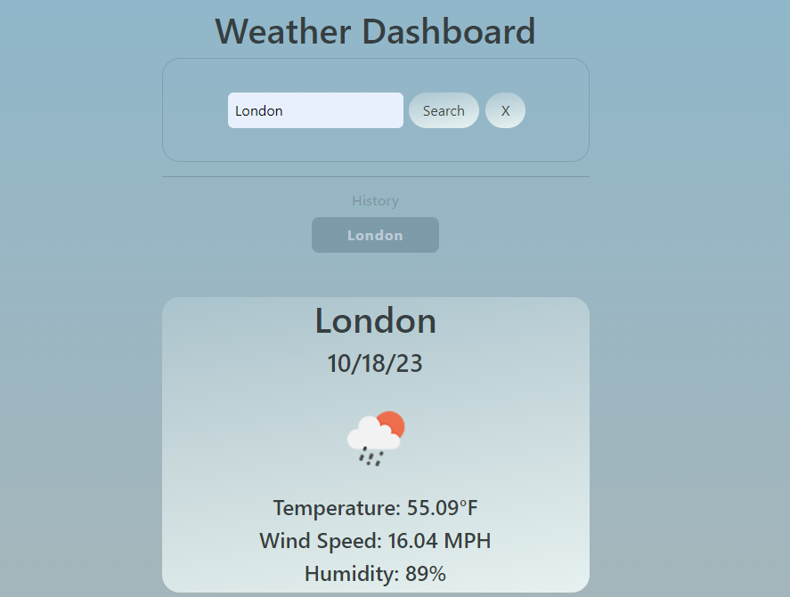

# weather-app
Simple app that checks the weather for your location
## Description
Weather application that will show the closest availible weather to your search entry. Searches are stored in local storage, a clear search button is used to clear the previous searches. The days weather is shown along with a 5 Day forcast underneath.

Page can be veiwed at https://kingbgreen5.github.io/weather-app/

## Installation
N/A

## Usage
Enter your search location and click the search button. Click "Clear Searches" to clear previous searches. Click any Search History Button to search that location again

=======

## Credits
Example code provided by Bootcamp lessons.

## License
MIT
